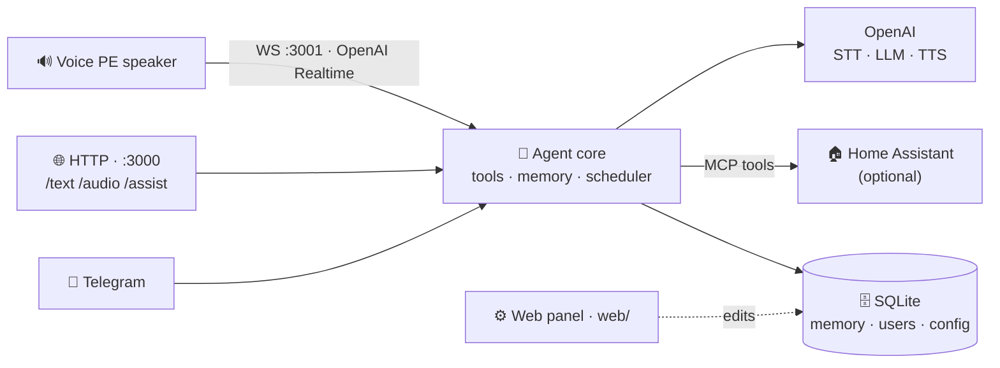

<div align="center">

# 🎙️ voice-assistant

**A self-hosted, voice-first personal assistant for your smart home.**

Talk to your house through a [Home Assistant Voice PE](https://www.home-assistant.io/voice-pe/)
speaker, an iOS Shortcut, or Telegram — one agent core, powered by OpenAI,
configured from a web panel, running on a Raspberry Pi.

[](https://github.com/maxmaxme/voice-assistant/actions/workflows/ci.yml)
[](LICENSE)
[](package.json)
[](https://github.com/maxmaxme/voice-assistant/pkgs/container/voice-assistant)

</div>

---

`voice-assistant` is the server side of a private smart-home assistant. It
brokers between the people talking to it (speaker, phone, chat), the language
model that understands them ([OpenAI](https://openai.com/)), and the home that
acts on it ([Home Assistant](https://www.home-assistant.io/)). Everything that used to be an environment variable — API keys,
models, which channels run, who's allowed in — now lives in a SQLite database
and is edited from a **web config panel**. `.env` carries nothing but process
knobs.

> **Works without Home Assistant.** No HA? It's still a capable chat assistant
> with memory, weather, and reminders — HA just adds device control.

## 🧭 Architecture



- **Voice PE — the primary voice path.** The
  [Home Assistant Voice PE](https://www.home-assistant.io/voice-pe/) speaker
  streams PCM16 audio both ways over a WebSocket into an OpenAI **Realtime**
  session — STT, the LLM, and TTS all happen in that one bidirectional stream.
  HA is reached only as an MCP tool backend here. (Firmware:
  [`home-assistant-voice-pe`](https://github.com/maxmaxme/home-assistant-voice-pe).)
- **HTTP** — `/text` + `/audio` for iOS-Shortcuts-style clients, and `/assist`
  for the Home Assistant Assist bridge (via
  [`ha-http-conversation-agent`](https://github.com/maxmaxme/ha-http-conversation-agent)).
- **Telegram** — text, voice, and photos into the same core.

## ✨ Features

- 🏠 **Smart-home control in plain language** across all three channels, sharing
  one agent core — or a standalone chat assistant when HA is absent
- ⚙️ **Configured from a web panel** ([`web/`](web/)), DB-backed, no env edits:
  integrations (OpenAI / HA / Telegram), tool gates, editable prompts, users &
  devices, per-channel toggles — applied on the next restart
- 🧠 **Long-term memory** in SQLite (`remember` / `recall` / `forget`) with a
  shared `household` scope and per-principal `personal` scopes
- ⏰ **Scheduled actions** — one-shot (wall-clock) or recurring (cron) goals,
  fired through a goal-mode agent
- 🙋 **`ask` tool** — clarifying questions reopen the HA Assist mic via
  `continue_conversation`, no new wake word
- 🔐 **DB-backed auth** — per-channel identities (Telegram chat / HTTP token /
  voice device token); raw tokens are never stored, only their hash
- 🚀 **Hands-off updates** — CI publishes an arm64 image to GHCR; the host stack
  pulls and restarts with healthcheck-gated rollback

## 📦 Requirements

- **Node.js 24+** — native TypeScript stripping, **no build step**
- **An [OpenAI API key](https://platform.openai.com/api-keys)** — entered in the
  web panel (mandatory)
- _Optional:_ a **Home Assistant** instance with the
  [MCP Server integration](https://www.home-assistant.io/integrations/mcp_server/),
  for device control

## 🚀 Quick start

```bash
# 1. Install (no native audio modules — plain install)
npm install

# 2. .env — process/infra knobs only; everything else has sane defaults
cp .env.example .env

# 3. Configure in the web panel (web/): install & enable the OpenAI integration
#    (mandatory), plus Home Assistant / Telegram if you want them.
#    See web/README.md.

# 4. Register yourself so a channel will admit you (see Users, auth & memory)
npm run users -- add-user --name me

# 5. Run — one process; each channel self-gates from the panel config
npm run start
```

On a fresh database the app **fails fast** until the OpenAI integration is
installed and enabled. Which channels then come up is decided by panel config,
not a flag — Telegram (integration + toggle), HTTP endpoints (their toggles),
Voice PE / realtime (its toggle). There is no `AGENT_MODE`.

## ⚙️ Configuration

Two sources, both applied on the next process start.

**Web panel ([`web/`](web/))** — a separate [Nuxt](https://nuxt.com/) SSR app
over the shared SQLite DB. It owns:

| Page                    | What you set                                                                                                                               |
| ----------------------- | ------------------------------------------------------------------------------------------------------------------------------------------ |
| **Integrations**        | OpenAI (key, model, effort, web search, realtime model/voice), HA (url + token), Telegram (bot token) — install / enable / connection-test |
| **Tools**               | Built-in tool gates (memory, reminders) + weather (units, default location)                                                                |
| **Prompts**             | Every system / tool prompt, editable, restore-to-default                                                                                   |
| **Users**               | Principals and their devices/identities (Telegram chats, HTTP & voice tokens)                                                              |
| **HA Voice / HTTP API** | Realtime enable switch (+ pacing / idle) and per-endpoint HTTP toggles                                                                     |

**`.env`** — process/infra only, **no secrets**:

| Variable           | Purpose                                | Default             |
| ------------------ | -------------------------------------- | ------------------- |
| `MEMORY_DB_PATH`   | SQLite file shared with the web panel  | `data/assistant.db` |
| `TZ`               | IANA timezone for scheduling / display | system tz           |
| `HTTP_SERVER_PORT` | HTTP server port                       | `3000`              |
| `REALTIME_PORT`    | realtime WebSocket port                | `3001`              |
| `LOG_LEVEL`        | `debug` / `info` / `warn` / …          | `info`              |

## 🔌 Channels

### 🔊 Voice PE (realtime)

Enable it on the panel's **HA Voice** page; the server listens at
`ws://<host>:3001/voice`. A speaker authenticates by presenting its own device
token — hashed and matched against a `voice` identity; unknown tokens are
rejected at the handshake. Each speaker is its own principal, so it gets its own
personal memory (e.g. its room). Register one with
`npm run users -- attach-voice` or the Users page.

### 🌐 HTTP

The HTTP server always runs (so `GET /health` is always up for the container
healthcheck); each input endpoint mounts only when its panel toggle is on.

| Endpoint       | Body                                               | Returns                             |
| -------------- | -------------------------------------------------- | ----------------------------------- |
| `POST /text`   | form-urlencoded, field `text`                      | `{response}`                        |
| `POST /audio`  | raw audio bytes (Content-Type sets the format)     | `{response, transcript}`            |
| `POST /assist` | JSON `{text, conversation_id?}` — HA Assist bridge | `{response, continue_conversation}` |
| `GET /health`  | —                                                  | `{status:"ok"}`                     |

All non-health endpoints require `Authorization: Bearer <token>`.

### 💬 Telegram

Install & enable the **Telegram** integration (bot token from
[@BotFather](https://t.me/BotFather)). The bot takes text, voice, and photos and
streams replies as live drafts. Commands: `/start`, `/help`, `/reset`,
`/profile`, `/update`. A chat is admitted only once it's a registered identity:

```bash
npm run users -- attach-telegram --user <id> --chat <chatId>
```

There is no fixed outbound chat — `send_to_telegram` and the reminder scheduler
resolve a recipient's chat from these identities.

## 🔐 Users, auth & memory

Auth is entirely **DB-backed** — no env allow-lists. Each request resolves to a
principal, which sets its memory scope:

- **Telegram** — admitted iff a `(telegram, chatId)` identity exists
- **HTTP** — the Bearer token's sha256 hash must match an `http` identity
- **Voice** — the WS bearer's sha256 hash must match a `voice` identity

Memory splits into a shared `household` scope and per-principal `personal`
scopes: every principal **reads** `household ∪ personal(self)` and **writes**
personal by default. Manage principals from the Users page or the `users` CLI.

## 🛠️ Commands

```bash
npm run start                        # the single entry point
npm run typecheck                    # tsc --noEmit
npm test                             # vitest run
npm run lint                         # eslint
npm run format                       # prettier --write .

npm run mcp:call -- list             # list HA's MCP tools (needs HA installed)
npm run mcp:call -- call HassTurnOn '{"name":"Kitchen Light"}'

# Users & devices (also doable from the panel's Users page)
npm run users -- add-user        --name Alex
npm run users -- attach-telegram --user <id> --chat <chatId>
npm run users -- attach-voice    --user <id> --token <device-token>
npm run users -- mint-http       --user <id>     # printed once; only its hash is stored
npm run users -- set-admin       --user <id>

npm run db:generate                  # Drizzle migration (voice-assistant owns the schema)
```

## 🧪 Tests

```bash
npm test                       # unit tests
RUN_INTEGRATION=1 npm test     # also runs the MCP test against a live HA on :8123
npm run typecheck
```

## 🚢 Deployment

CI builds the root `Dockerfile` and publishes
`ghcr.io/maxmaxme/voice-assistant:latest` on every push to `main`. Host-side
compose, systemd units, healthchecks and monitoring live in a separate
(private) `home-infra` repo — not this repo's concern.

## 📚 Docs

|                                             |                                                                                                                            |
| ------------------------------------------- | -------------------------------------------------------------------------------------------------------------------------- |
| 🏠 Home Assistant setup                     | [docs/home-assistant-setup.md](docs/home-assistant-setup.md)                                                               |
| 📱 iPhone Shortcuts                         | [docs/iphone-shortcuts.md](docs/iphone-shortcuts.md)                                                                       |
| ⚙️ Web config panel                         | [web/README.md](web/README.md)                                                                                             |
| 🧱 Architecture (for contributors / agents) | [CLAUDE.md](CLAUDE.md)                                                                                                     |
| 📐 Design spec                              | [docs/superpowers/specs/2026-04-25-voice-assistant-design.md](docs/superpowers/specs/2026-04-25-voice-assistant-design.md) |
| 🗺️ Roadmap                                  | [docs/superpowers/roadmap.md](docs/superpowers/roadmap.md)                                                                 |

## 🤝 Contributing

A personal project, but issues and PRs are welcome. Conventions (no build step,
`.ts` imports, the adapter pattern, the prompt registry, the DB-backed config
model) are documented in [CLAUDE.md](CLAUDE.md) — please skim it first. `npm run
typecheck && npm test && npm run lint` should be green before a PR.

## 📄 License

Copyright © 2026 maxmaxme.

Licensed under the **GNU Affero General Public License v3.0 or later**
([AGPL-3.0-or-later](LICENSE)). Use, study, modify, and self-host it freely — but
any modified version you distribute **or run as a network service** must also be
released under the AGPL, source and all. No warranty.
